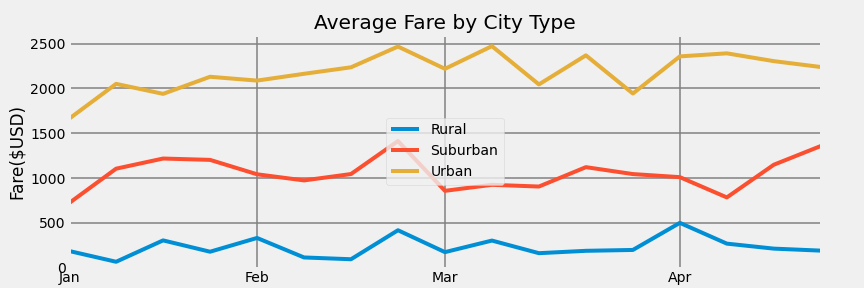
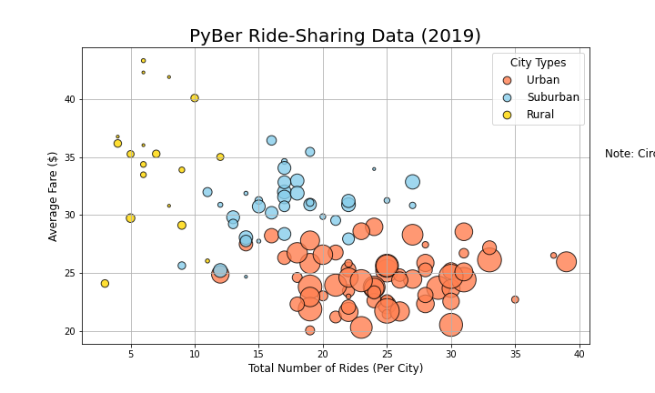
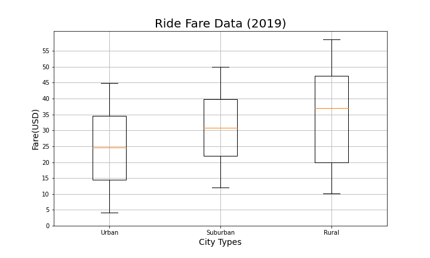
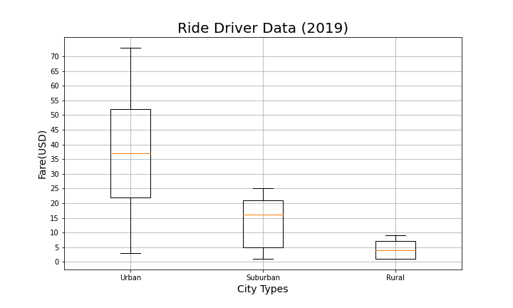

# PyBer-Analysis
Outcomes based on analysis of PyBer Ride - Share data.
## Overview of Analysis:
We have been asked by the CEO of PybBer to create visualizations that capture the ride - sharing data given:
- Original Csv Resources
  - [PyBer Ride Data](Resources/PyBer_ride_data.csv)
  - [City Data](Resources/city_data.csv)
  - [Ride data](Resources/ride_data.csv)

In addition to scatter and pie charts, the CEO has specifically requested a summary table of the key metrics of the ride-sharing data by city type, and a multiple-line graph that shows the average fare for each week by each city type.

## Analysis Results:
#### Summary DataFrame
(PICTURE)
- Urban:
  - had the highest of the total rides, total drivers, and total fares.
  - lowest Average fare per ride and per driver.
    - This shows that there are a lot of people driving and using the service in this city type, having a result of a lower average fare.
- Suburban:
  - Had second highest in total rides and drivers.
  - there are a thousand less rides than in urban cities nut almost 2 thousand less drivers. This makes the increase in average fare per driver larger.
- Rural:
  - Highest average fares due to low volume of rides and drivers. The fewer the drivers and rides, the more expensive the fares.

#### Multiple Line Graph showing the average fare for each week by each city type.

- Urban:
  - the urban fares are higher at the beginning of the month than the end.
  - urban fares fluctuate a lot between march and april after being at their highest.

- Suburban:
 - the highest fare is also around march.
 - has a peak between april and may that does not exist for the other 2 city types    

- Rural:
  - only city type that stays in a range of 500 between the months.
  - a few distinct peaks in beginning of feb, end of feb, and beginning of april.
  - generally has a higher fare than all other city types but since there are not many rides it will always be the bottom line.

## Summary:
Based on the above analysis, I suggest:
1. Some Drivers in the urban areas can be redirected to the suburban areas. There are a higher percentage of rides in comparison to the percentage of drivers.
2. Some Drivers can also be directed from the urban areas to the rural areas where the Average fare per driver is higher due to lack of drivers.
3. If the PyBer app had access to this data it could determine the percentages of drivers in different areas and redistribute them so that the wages are more equal between the drivers in the different areas.

#### Additional Visualizations

